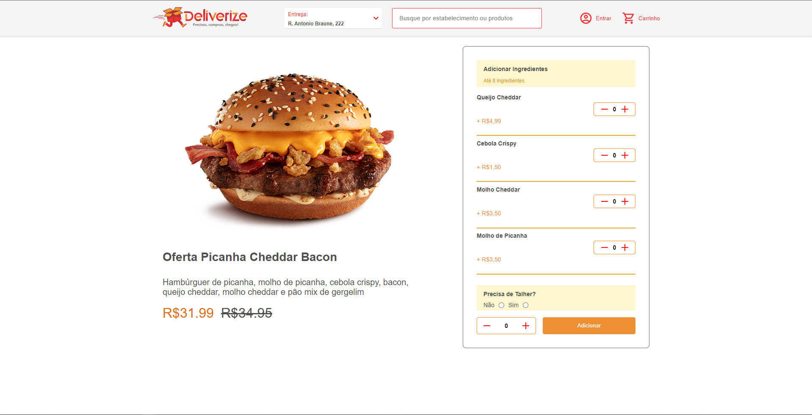

<h1 align='center'> :hamburger: Desafio técnico: TeamSoft </h1>

### ✅ Demonstração da aplicação

[Clique Aqui](https://teamsoft-desafio.vercel.app/).


## Desktop (web)
<details>

</details


## 

## Mobile
<details>

</details


## 

## Visão Geral

⚠️ Observações:
Não foi possível encontrar a logo através do Endpoint disponibilizado no repositório do teste técnico.
#### 🧭 Rodando a aplicação web (Frontend)

```bash

# Clone este repositório
$ git clone git@github.com:andersona16/Teamsoft-desafio.git

# Acesse a pasta do projeto no seu terminal/cmd
$ cd Teamsoft-desafio

# Caso queira acessar a aplicação pelo o Visual Studio Code.
$ code .

# Instale as dependências
$ yarn

# Execute a aplicação em modo de desenvolvimento
$ yarn start

# A aplicação será aberta na porta:3000 - acesse http://127.0.0.1:5173/

```
### 🛠 Stack utilizada

As seguintes ferramentas foram usadas na construção do projeto:

- [ReactJS](https://pt-br.reactjs.org/)
- [TypeScript](https://www.typescriptlang.org/)
- [Axios](https://axios-http.com/docs/intro)
- [React-Spring](https://react-spring.dev/)
- [React-icons](https://react-icons.github.io/react-icons/)
- [uuid]()


## 🦸 Autor

[](https://www.linkedin.com/in/andersonaraujjo/)
[](mailto:andersonaraujoc1@gmail.com)
